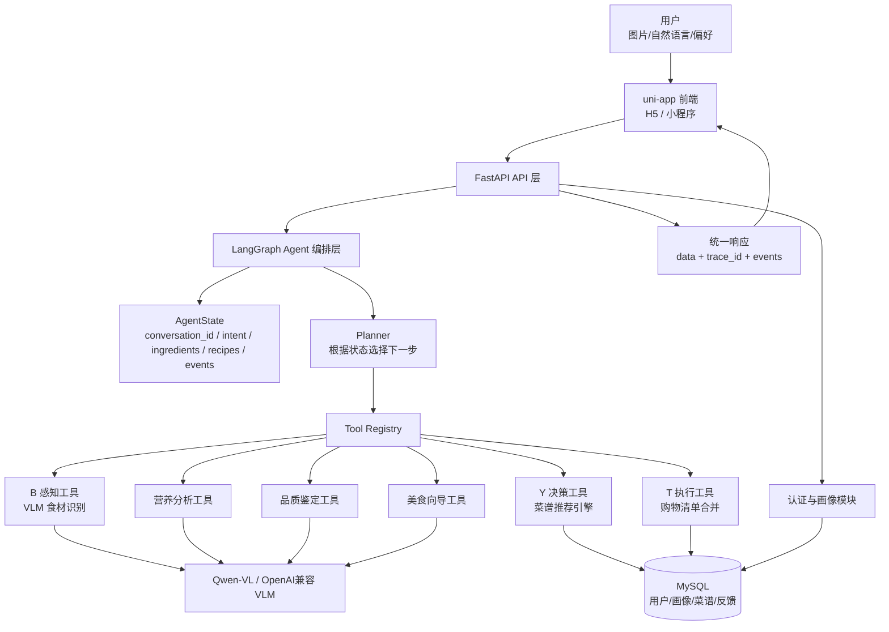
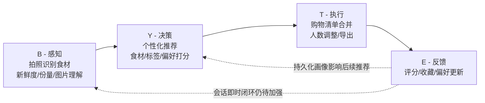
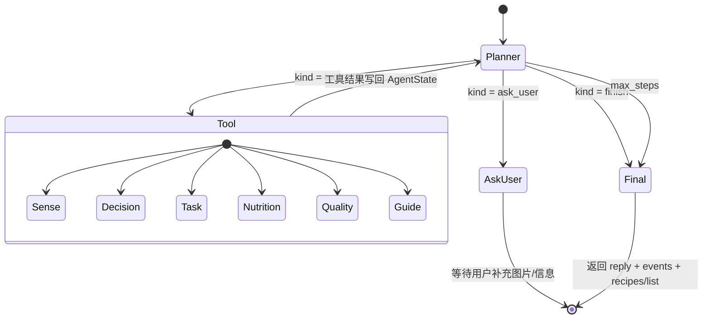
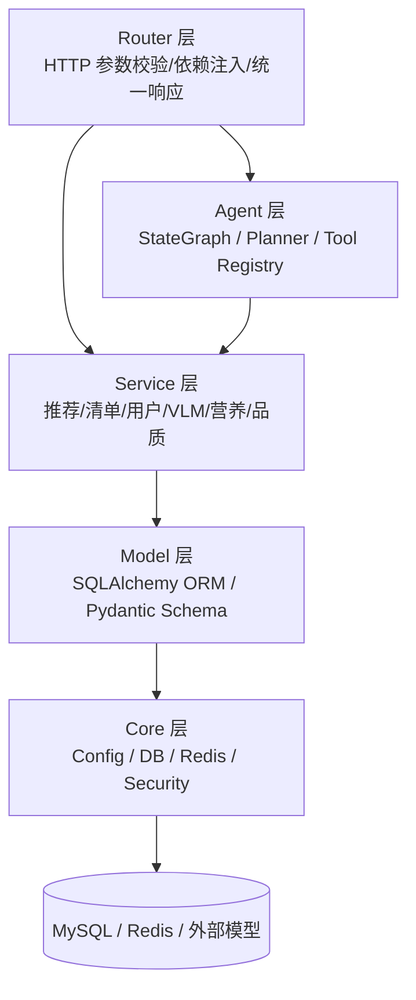
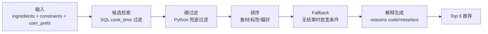
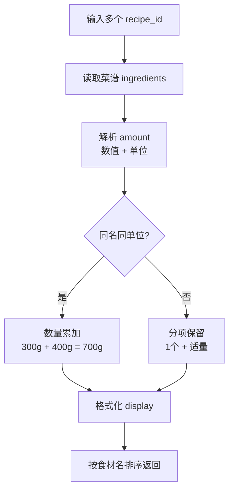
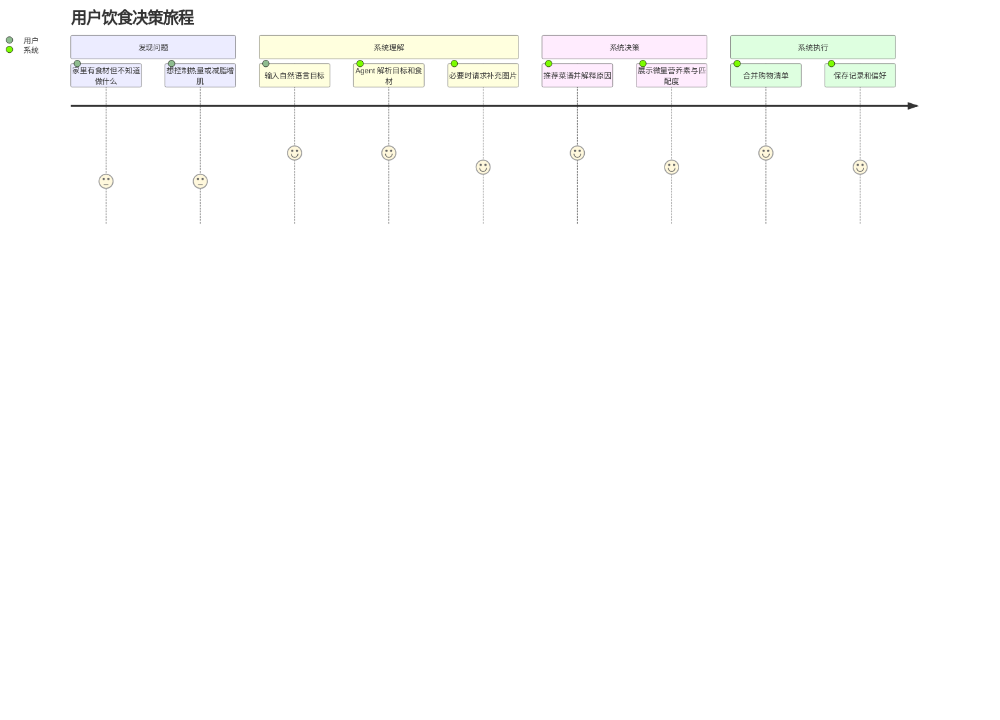
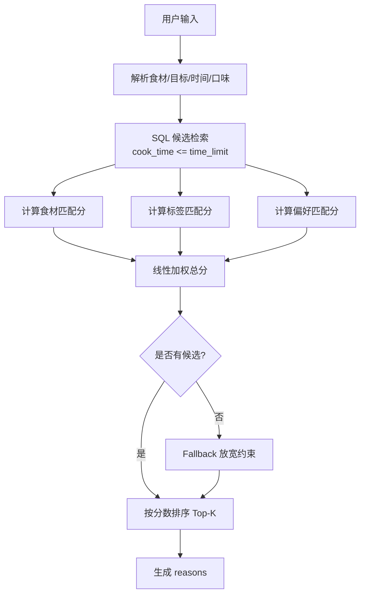

# ByteSavor 综合技术与答辩文档

> 项目名称：基于多模态 Agent 的全场景饮食全链路解析系统  
> 文档日期：2026-06-11  
> 适用场景：期末展演、软件工程答辩、算法设计讲解、后续开发交接  
> 当前状态：已实现可运行的 LangGraph 状态化工具调用 Agent；仍未完成生产级自主 ReAct Planner、持久化会话记忆和安全闭环。

---

## 0. 阅读结论

ByteSavor 不是单一菜谱查询 App，而是一个围绕饮食场景构建的全链路系统：

1. 用户输入图片或自然语言目标。
2. 系统通过多模态模型识别食材、餐食或菜品。
3. Agent 根据用户目标、识别结果、偏好和当前会话状态动态选择工具。
4. 推荐引擎从菜谱库中生成可解释推荐。
5. 任务执行模块合并购物清单。
6. 用户反馈写入偏好，作为后续推荐依据。

当前版本最重要的工程进展是：`/v1/agent/execute` 已接入真实 LangGraph `StateGraph`，并在前端展示 `plan / tool_start / tool_result / ask_user / final` 事件流。它已经不是“前端顺序调用几个 API”，而是一个具备显式状态、工具注册、条件路由、多轮上下文和可观测过程的可运行 Agent。

但也必须如实说明：当前 Planner 主要是确定性规则，并不是完全由 LLM 自主生成下一步动作；会话状态目前为进程内存，不是生产级 Redis/Postgres checkpointer；反馈到 Agent 会话态的即时闭环仍未彻底完成。

---

## 1. 项目整体介绍

### 1.1 项目定位

ByteSavor 面向“今天吃什么、怎么做、买什么、是否健康”这一连续饮食场景，目标是把原本割裂的功能整合成一条可执行链路。

传统流程通常是：

```text
拍照识别食材 -> 去菜谱软件搜索 -> 去健康软件估热量 -> 手动整理购物清单 -> 下次重新来一遍
```

ByteSavor 的流程是：

```text
拍照/输入目标 -> Agent 理解意图 -> 调工具识别/推荐/分析 -> 生成菜谱与清单 -> 记录偏好 -> 下次更个性化
```

### 1.2 一句话说明

ByteSavor 是一个基于多模态 Agent 的饮食全链路系统：用户拍照或输入饮食目标后，系统自动完成食材感知、个性化菜谱推荐、营养分析、购物清单合并和反馈学习。

### 1.3 核心用户角色

| 角色 | 场景 | 系统价值 |
|---|---|---|
| 普通做饭用户 | 家里有几种食材，不知道做什么 | 根据现有食材和时间限制推荐菜谱 |
| 健康管理用户 | 减脂、增肌、控碳水 | 推荐高蛋白、低碳水或均衡菜谱，并展示热量与营养素 |
| 采购用户 | 选了多道菜，需要买菜 | 合并重复食材，生成更清晰的购物清单 |
| 探索型用户 | 不知道想吃什么 | 通过探索菜谱、微量营养素和菜品知识获得灵感 |
| 答辩/演示评委 | 关注系统是否完整、能否跑通 | 可展示从输入到 Agent 事件流再到推荐/清单的完整链路 |

### 1.4 主要功能模块

| 模块 | 功能 | 当前实现 |
|---|---|---|
| 用户认证与画像 | 注册、登录、目标与偏好保存 | 已实现 JWT、Profile、偏好读取 |
| B 感知 Sense | 图片食材识别、品质/营养/向导输入 | 已接 VLM Provider；VLM 不可用时返回错误，不再伪造 mock |
| Y 决策 Decision | 菜谱检索、过滤、排序、解释 | 已实现 SQL 时间过滤、双向食材覆盖率、偏好加权 |
| T 执行 Task | 多菜谱购物清单合并 | 已实现同名同单位累加、展示格式化 |
| E 反馈 Feedback | 评分后更新偏好 | 已实现持久化偏好更新；会话即时闭环仍需加强 |
| Agent 编排 | 自然语言任务规划与工具调用 | 已实现 LangGraph StateGraph、工具事件流、多轮上下文 |
| 前端 UI | 首页、探索、识别、清单、设置、历史等 | 已整合 Agent 对话时间线与推荐展示 |

---

## 2. 软件规模与评分指标对照

### 2.1 软件规模

统计口径：只统计核心可读源码，不统计构建产物、`node_modules`、大体积菜谱 JSON 数据和 PDF/PPT 文档。

| 指标 | 当前数值 | 说明 |
|---|---:|---|
| 核心源码文件总数 | 87 | `app`、`bsapp/src`、`tests`、`demo_tests` 下 Python/Vue/JS/TS |
| 核心源码总行数 | 9100 | 不含 seed 大数据 JSON 和 dist 构建产物 |
| 自动化测试用例数 | 37 | pytest 实际收集并通过 |
| 后端路由模块 | 11 | auth/user/sense/decision/task/agent/feedback 等 |
| 菜谱数据规模 | 2576 道左右 | seed 菜谱库，作为推荐检索基础 |
| 前端页面 | 10+ | 首页、探索、识别、清单、详情、设置、历史、登录等 |

### 2.2 展演评分点对照

| 评分项 | 分值 | ByteSavor 对应材料 |
|---|---:|---|
| 软件功能设计是否合理、有逻辑性、符合场景 | 20 | B-Y-T-E 全链路、角色场景、Agent 编排图 |
| 功能点实现是否完整、符合预期需求 | 20 | 五类演示场景：推荐、识别、清单、营养、向导 |
| 现场演示是否顺畅、数据信息处理是否正确、无 Bug | 40 | 本地服务、Swagger、前端 H5、Playwright 烟测 |
| 软件规模是否符合要求 | 15 | 87 文件、9100 行、37 测试，超过要求 |
| 是否有特色功能、设计亮点、技术难点 | 5 | LangGraph Agent、多模态 VLM、可解释推荐、微量营养素、清单合并 |

---

## 3. 整体框架图

### 3.1 系统总览图



### 3.2 B-Y-T-E 全链路图



说明：当前已实现“反馈影响后续推荐”的持久化闭环，但“同一会话内反馈立即改变 Agent 状态”的闭环还没有完全生产化。

### 3.3 Agent 状态图



### 3.4 后端分层图



---

## 4. 技术文档部分

### 4.1 技术栈

| 层级 | 技术 | 用途 |
|---|---|---|
| 前端 | uni-app、Vue3、Pinia、Vite5、Sass | H5/小程序 UI、状态管理、构建 |
| 后端 | FastAPI、Pydantic、Uvicorn | API 服务、请求响应模型、异步 Web 服务 |
| 数据 | MySQL、SQLAlchemy Async、asyncmy | 用户、画像、菜谱、反馈持久化 |
| 缓存 | Redis | 缓存与未来会话状态扩展 |
| Agent | LangGraph | StateGraph、条件边、工具调用循环 |
| AI/VLM | OpenAI 兼容 VLM、DashScope/Qwen-VL、DeepSeek/Ollama 相关接口 | 食材识别、自然语言增强、降级能力 |
| 测试 | pytest、pytest-asyncio、Playwright | 后端自动化测试、前端运行态烟测 |

### 4.2 关键目录

```text
app/
  agent/                 # 当前真实 Agent 核心
    state.py             # AgentState 与基础意图解析
    planner.py           # 规则 Planner，决定下一步动作
    tools.py             # ToolRegistry，统一工具接口
    runtime.py           # 确定性运行时，便于单元测试
    langgraph_runtime.py # LangGraph StateGraph 生产入口
  routers/               # FastAPI 路由
    agent.py             # /v1/agent/execute
    sense.py             # /v1/sense/analyze
    decision.py          # /v1/decision/meal-plan
    task.py              # /v1/task/merge-list
  services/
    decision.py          # 推荐 pipeline
    shopping.py          # 清单合并
    vlm/                 # VLM Provider 和 Prompt

bsapp/src/
  pages/home/home.vue    # 首页、AI 助手、Agent 事件流展示
  api/index.js           # 前端 API 封装
  store/                 # 前端状态

tests/
  test_agent*.py         # Agent、LangGraph、API 多轮上下文测试
  test_decision.py       # 推荐与菜谱详情测试
  test_sense.py          # VLM 不可用契约测试
  test_shopping.py       # 清单合并单元测试
```

### 4.3 API 统一返回

系统使用统一响应结构：

```json
{
  "status": "success",
  "data": {},
  "trace_id": "..."
}
```

Agent 接口的核心返回结构：

```json
{
  "status": "success",
  "conversation_id": "conv_xxx",
  "trace_id": "5af298904732",
  "next_action": "complete",
  "reply": "已找到 8 个菜谱，优先推荐「芹菜炒牛肉」。",
  "intent": {
    "goal": "fat_loss",
    "time_limit": 30,
    "taste": "",
    "ingredients": ["牛肉", "南瓜"]
  },
  "recipes": [],
  "shopping_list": [],
  "events": [
    {"type": "plan", "tool": "decision", "reason": "根据食材和约束生成推荐"},
    {"type": "tool_start", "tool": "decision"},
    {"type": "tool_result", "tool": "decision", "status": "success", "summary": {"recipe_count": 8}},
    {"type": "final", "message": "已找到 8 个菜谱..."}
  ],
  "degraded": false
}
```

### 4.4 Agent 设计

#### 4.4.1 为什么它是 Agent，而不是 API 串联

普通 API 串联通常是固定流程：

```text
先识别 -> 再推荐 -> 再清单
```

当前 ByteSavor Agent 的实际行为是：

```text
用户输入 -> 生成 AgentState -> Planner 判断目标
  -> 只问营养：走 Nutrition
  -> 只问文化：走 Guide
  -> 要购物清单：先 Decision，回写 recipes，再 Task
  -> 要识别但没图：AskUser
  -> 工具失败：写入 errors/degraded
  -> 达成目标：Final
```

Agent 的必要要素对应如下：

| Agent 要素 | 当前实现 |
|---|---|
| 显式状态 | `AgentState` 保存 intent、ingredients、recipes、events、errors |
| 工具集合 | `ToolRegistry` 注册 sense/decision/task/nutrition/quality/guide |
| 动态路由 | `planner.py` 根据用户输入和状态决定下一步 |
| 工具结果回写 | `runtime.py` / `langgraph_runtime.py` 将工具输出合并回 state |
| 多轮上下文 | 同一 `conversation_id` 可复用上一轮 recipes |
| 可观测过程 | 前后端展示 events 时间线 |
| 终止条件 | finish、ask_user、max_steps、tool_error |

#### 4.4.2 当前 Agent 执行示例

用户输入：

```text
牛肉南瓜减脂30分钟，推荐一道菜
```

执行过程：

```text
1. 解析 intent: goal=fat_loss, time_limit=30, ingredients=[牛肉, 南瓜]
2. Planner 选择 decision 工具
3. decision 从数据库检索 30 分钟内菜谱
4. 推荐引擎计算食材/标签/偏好分
5. 返回推荐菜谱与 reasons
6. Final 生成自然语言回复
7. 前端展示 plan/tool/result/final 时间线
```

第二轮输入：

```text
把刚才的菜生成购物清单
```

执行过程：

```text
1. conversation_id 命中上轮会话状态
2. 复用上一轮 recipes
3. Planner 选择 task 工具
4. task 合并购物清单
5. 返回 shopping_list
```

### 4.5 推荐算法

#### 4.5.1 Pipeline



#### 4.5.2 打分公式

当前推荐分由三部分构成：

```text
score = ingredient_score * 0.5 + tag_score * 0.3 + preference_score * 0.2
```

食材分采用双向覆盖率：

```text
ingredient_score =
  recipe_coverage * 0.6 + user_coverage * 0.4

recipe_coverage = 命中食材数 / 菜谱所需食材数
user_coverage   = 命中食材数 / 用户已有食材数
```

这样可以避免两个问题：

1. 只看菜谱侧覆盖率时，复杂菜谱容易被过度惩罚。
2. 只看用户侧覆盖率时，只命中用户一个食材的菜谱可能虚高。

#### 4.5.3 可解释推荐

每条推荐返回 `reasons`：

```json
[
  {"code": "ING_MATCH", "text": "已有食材: 牛肉", "meta": {"ingredient": "牛肉"}},
  {"code": "HIGH_PROTEIN_GOAL", "text": "高蛋白适合减脂", "meta": {"goal": "减脂"}}
]
```

答辩时可以强调：推荐不是黑盒，用户能看到“为什么推荐它”。

### 4.6 购物清单算法

购物清单模块解决“多道菜重复食材合并”的问题。



当前特点：

- 支持 `g/ml/kg/l/个/根/瓣/勺/只/条/块/把/片` 等单位。
- 相同食材、相同可计算单位自动合并。
- 不同单位或模糊用量保留独立项，避免错误累加。
- 整数展示去掉 `.0`，如 `700g` 而不是 `700.0g`。

### 4.7 多模态识别与 VLM 契约

Sense 模块接收图片 URL，调用 VLM Provider 进行识别。当前重要修复是：当 VLM 不可用时，接口返回错误，不再返回伪造 mock 食材。

这对答辩很重要：

```text
我们可以用演示数据，但接口层不再把 mock 包装成真实识别结果。
```

建议讲法：

> 演示时如果配置了真实 VLM Key，就走真实多模态识别；如果模型不可用，系统会明确返回 VLM_UNAVAILABLE，不会把固定假数据当作模型结果。

### 4.8 前端 Agent 可视化

首页 AI 助手不再只显示一句回复，而是展示 Agent 的中间过程：

```text
规划下一步 -> 调用工具 -> 推荐完成 -> Agent 完成
```

前端展示价值：

1. 评委能看到系统不是一次普通 API 返回。
2. 用户能知道系统正在理解、检索、推荐还是等待补充图片。
3. 出错时可以展示哪个工具失败，便于调试。

---

## 5. 讲解文档部分

本节是答辩时可以直接讲的口语化说明。

### 5.1 开场介绍

各位老师好，我们的项目叫 ByteSavor，中文可以理解为“字节食味”。它不是单纯的菜谱软件，而是一个基于多模态 Agent 的饮食全链路系统。

我们关注的是一个真实生活问题：用户不是只想查一道菜，而是想解决“我现在有什么食材、适合吃什么、怎么做、还缺什么、下次能不能更懂我”这一整条链路。

所以我们把系统设计成 B-Y-T-E 四个阶段：

- B，感知：用图片或文字理解用户当前有什么食材或餐食。
- Y，决策：根据食材、健康目标和偏好推荐菜谱。
- T，执行：把选中的菜谱转成购物清单。
- E，反馈：根据评分和设置更新用户偏好。

### 5.2 为什么要做 Agent

如果只是普通 App，用户点识别就是识别，点推荐就是推荐，点清单就是清单。每个功能之间是割裂的。

我们的 Agent 目标是让用户用一句话完成任务。例如：

```text
牛肉南瓜减脂30分钟，推荐一道菜。
```

系统会自动识别这是一个“推荐任务”，解析出：

- 食材：牛肉、南瓜
- 目标：减脂
- 时间：30 分钟

然后 Agent 决定调用推荐工具，而不是固定把所有工具都跑一遍。

如果用户说：

```text
把刚才推荐的菜生成购物清单。
```

Agent 会复用同一会话里的上一轮推荐结果，直接调用清单工具。

如果用户说：

```text
识别这张图片里的食材。
```

但没有上传图片，Agent 不会乱编结果，而是返回“请先上传图片”。

这就是我们从固定 API 调用升级到状态化 Agent 的核心区别。

### 5.3 推荐算法怎么讲

推荐系统不是简单查关键词，而是三部分综合打分：

```text
总分 = 食材匹配 50% + 标签匹配 30% + 偏好匹配 20%
```

食材匹配解决“我有什么”；标签匹配解决“我适合什么”；偏好匹配解决“我喜欢什么”。

例如用户输入牛肉、南瓜、减脂，系统会优先推荐：

- 命中牛肉或南瓜的菜。
- 30 分钟内能做完的菜。
- 高蛋白、低碳水、更适合减脂的菜。
- 如果用户历史偏好 spicy 或 high_protein，对应菜谱会加分。

每条推荐都会返回理由，比如“已有食材：牛肉”“高蛋白适合减脂”。这让推荐结果可以被解释，而不是一个黑盒排序。

### 5.4 软件工程亮点怎么讲

我们的工程亮点有四个：

第一，前后端分层清晰。前端负责交互和展示，后端负责认证、Agent 编排、推荐、清单和模型调用。

第二，Agent 过程可观测。每次执行都会返回 `trace_id` 和 `events`，包括规划、工具调用、工具结果和最终回复，便于演示和调试。

第三，测试覆盖关键链路。当前有 37 个 pytest 用例，覆盖认证、推荐、清单、Agent、多轮上下文和 VLM 不可用契约。

第四，系统承认失败状态。比如 VLM 不可用时返回错误，不再把 mock 数据伪装成真实 AI 结果。

### 5.5 算法亮点怎么讲

算法层面重点讲三件事：

1. 多目标推荐：不是单一关键词匹配，而是食材、标签、偏好加权。
2. 双向覆盖率：既考虑菜谱需要多少食材被满足，也考虑用户已有食材有多少被利用。
3. 可解释性：推荐结果不是只给分数，而是给出结构化理由。

如果老师问权重为什么是 0.5/0.3/0.2，要如实回答：

> 当前权重来自业务启发式设计，已通过功能测试验证可运行，但还没有完成离线标注集和 NDCG/HitRate 调参。后续会用 50-100 条人工标注查询做离线评估。

这样比硬说“最优”更稳。

---

## 6. 答辩文档部分：软件工程视角

### 6.1 软件功能设计

ByteSavor 的功能不是平铺列表，而是围绕用户饮食决策链路展开。



### 6.2 用例总览

| 用例编号 | 用例名称 | 参与者 | 结果 |
|---|---|---|---|
| UC-01 | 注册/登录 | 用户 | 获取 token 并进入系统 |
| UC-02 | 设置健康目标与偏好 | 用户 | 保存 goal/preferences |
| UC-03 | 图片识别食材 | 用户、VLM | 返回食材、新鲜度、份量等 |
| UC-04 | 自然语言推荐菜谱 | 用户、Agent | 返回推荐、理由、事件流 |
| UC-05 | 探索菜谱 | 用户 | 无食材也能获得推荐 |
| UC-06 | 查看菜谱详情 | 用户 | 查看步骤、营养、微量营养素 |
| UC-07 | 合并购物清单 | 用户 | 多菜谱食材合并 |
| UC-08 | 营养分析 | 用户、VLM | 返回热量和宏量营养素 |
| UC-09 | 品质鉴定 | 用户、VLM | 返回食材品质判断 |
| UC-10 | 美食向导 | 用户、VLM | 返回菜系、故事和吃法 |
| UC-11 | 评分反馈 | 用户 | 更新偏好 |
| UC-12 | 多轮 Agent 任务 | 用户、Agent | 复用上一轮推荐生成清单 |

### 6.3 质量保障

当前测试覆盖：

| 测试文件 | 覆盖重点 |
|---|---|
| `tests/test_auth.py` | 注册、重复注册、登录失败、画像权限 |
| `tests/test_decision.py` | 推荐、探索、详情、微量营养素 |
| `tests/test_shopping.py` | 用量解析、同单位合并、展示格式 |
| `tests/test_sense.py` | VLM 不可用不返回 mock |
| `tests/test_agent.py` | Agent API、事件流、缺图追问、多轮上下文 |
| `tests/test_agent_runtime.py` | Agent Runtime 工具选择与状态循环 |
| `tests/test_langgraph_agent.py` | LangGraph 条件工具循环和会话记忆 |

最近验证结果：

```text
pytest -q
37 passed, 2 warnings
```

前端构建：

```text
npm run build:h5
DONE Build complete.
```

前端运行态烟测：

```json
{
  "hasPlan": true,
  "hasTool": true,
  "hasResult": true,
  "hasFinal": true,
  "hasRecipe": true
}
```

### 6.4 工程取舍

| 决策 | 原因 | 风险 |
|---|---|---|
| 先实现确定性 Planner，再接 LLM Planner | 便于测试和答辩稳定演示 | 智能性不如完全自主规划 |
| VLM 不可用时返回错误，不返回 mock | 避免把假数据当真 AI 结果 | 演示必须提前配置模型或准备降级说明 |
| 推荐算法先用启发式加权 | 开发周期内可解释、可控 | 缺少离线指标证明最优 |
| 会话状态先用内存 | 快速实现多轮演示 | 多进程/重启后丢失 |
| 保留兼容字段 `stages` | 避免旧前端或旧文档完全失效 | 容易让人误以为仍是固定三阶段 |

---

## 7. 答辩文档部分：算法视角

### 7.1 算法问题定义

输入：

```text
用户食材 I = {i1, i2, ...}
用户约束 C = {time_limit, taste, goal}
用户偏好 P = {p1, p2, ...}
菜谱库 R = {r1, r2, ...}
```

输出：

```text
Top-K 推荐菜谱，每条包含：
recipe_id, title, match_score, macros, micronutrients, reasons
```

目标：

1. 尽量利用用户已有食材。
2. 满足时间、口味和健康目标。
3. 尊重用户历史偏好。
4. 给出可解释理由。

### 7.2 推荐排序流程



### 7.3 微量营养素补充

当前菜谱展示不仅有热量、蛋白质、碳水和脂肪，也加入了微量营养素字段，例如：

- 膳食纤维 `fiber`
- 维生素 C `vitamin_c`
- 铁 `iron`
- 钙 `calcium`
- 钾 `potassium`
- 叶酸 `folate`
- Omega-3 `omega3`

这使推荐结果从“能不能做”扩展到“吃得是否更健康”。

### 7.4 Agent 规划算法

当前 Planner 是规则驱动：

```text
if 用户问营养:
    没图 -> ask_user
    有图 -> nutrition
elif 用户问文化/探店:
    没图 -> ask_user
    有图 -> guide
elif 用户问品质:
    没图 -> ask_user
    有图 -> quality
elif 用户要求识别图片:
    没图 -> ask_user
    有图 -> sense
elif 用户要求推荐或清单:
    没 recipes -> decision
    要清单且已有 recipes -> task
else:
    默认 decision
```

它的优势是可测、稳定、适合现场演示；缺点是语言理解能力有限。后续可以升级为：

```text
LLM 生成受 JSON Schema 约束的 AgentAction
后端校验工具白名单和参数
LangGraph 执行动作并回写状态
```

---

## 8. 现场演示建议

### 8.1 推荐演示脚本

推荐现场演示顺序：

1. 打开前端首页。
2. 在 AI 助手输入：

```text
牛肉南瓜减脂30分钟，推荐一道菜
```

3. 展示 Agent 时间线：

```text
规划下一步 -> 调用 decision -> 推荐完成 -> Agent 完成
```

4. 展示推荐菜谱卡片和理由。
5. 再输入：

```text
把刚才的菜生成购物清单
```

6. 展示系统复用上一轮推荐，生成清单。

### 8.2 如果 VLM 网络不可用

答辩时不要说“识别一定能跑”。建议准备两套演示：

第一套：模型 Key 和网络正常，展示真实图片识别。

第二套：如果模型不可用，直接说：

> 我们这里不返回伪造 mock 数据，系统会明确提示 VLM_UNAVAILABLE。为了保证现场演示完整，我先展示自然语言 Agent 推荐链路，这部分不依赖外部视觉模型。

这比现场出现固定假结果更可信。

### 8.3 建议展示的页面

| 顺序 | 页面 | 重点 |
|---|---|---|
| 1 | 首页 AI 助手 | Agent 事件流、推荐结果 |
| 2 | 探索菜谱 | 菜谱数据量、微量营养素 |
| 3 | 菜谱详情 | 步骤、营养、收藏/记录 |
| 4 | 购物清单 | 多菜谱合并食材 |
| 5 | 设置 | 目标与偏好影响推荐 |
| 6 | Swagger 或测试结果 | 工程可信度 |

---

## 9. 还未解决的问题

这一部分建议答辩时不要主动展开太多，但如果老师追问，要诚实、有优先级地回答。

### 9.1 P0/P1 级问题

| 问题 | 当前状态 | 风险 | 后续方案 |
|---|---|---|---|
| OpenID 生产认证 | 仍偏演示模式 | 前端直传 openid 有账户冒用风险 | 接入微信 `code2session`，后端换取 openid |
| 图片输入安全 | 未完整解决 | URL 指向超大文件或内网地址可能造成 DoS/SSRF | 统一图片代理下载、scheme/host 白名单、Content-Length 和字节上限 |
| 会话记忆持久化 | 当前为进程内存 | 服务重启/多 worker 会丢失上下文 | 使用 Redis 或 LangGraph 持久化 checkpointer |
| E->B 即时闭环 | 持久化偏好已影响后续推荐，但未直接改当前 AgentState | 同会话反馈不能立即反映到下一步 | Feedback 关联 conversation_id 并更新会话态 |
| LLM Planner | 当前为规则 Planner | 对复杂自然语言理解有限 | 引入 schema 约束的 LLM Action Planner |

### 9.2 P2/P3 级问题

| 问题 | 当前状态 | 后续方案 |
|---|---|---|
| 推荐权重未离线调参 | 0.5/0.3/0.2 为启发式 | 建人工标注集，计算 NDCG/HitRate |
| 候选召回仍较简单 | 主要依赖 SQL 时间过滤和内存排序 | 食材倒排索引、标签索引、向量召回 |
| Redis 缓存策略不完善 | 有通用缓存，缺少分类 TTL 和击穿保护 | 制定 key/TTL/失效策略 |
| 数据质量标注不足 | 部分菜谱来源混合 | 增加 data_quality、nutrition_confidence |
| Sass 构建警告 | 构建可过，但有 deprecation warning | 升级 Sass 写法，替换 `@import` |

---

## 10. 面向答辩的问答准备

### Q1：你们这个和普通菜谱 App 有什么区别？

普通菜谱 App 主要是搜索和展示。ByteSavor 强调全链路：识别食材、理解目标、推荐菜谱、生成清单、反馈偏好。尤其是现在接入了 Agent 状态图后，用户可以用自然语言跨步骤完成任务。

### Q2：你们说是 Agent，Agent 体现在哪里？

体现在四点：

1. 有显式 `AgentState`，保存意图、食材、菜谱、清单、错误和事件。
2. 有工具注册表，Sense/Decision/Task/Nutrition/Quality/Guide 都是工具。
3. 有 LangGraph `StateGraph` 和条件路由，不是固定顺序调用。
4. 有多轮上下文，同一 `conversation_id` 能复用上一轮推荐继续生成清单。

同时我们也承认：当前 Planner 是规则驱动，不是完全自主 ReAct。

### Q3：算法有什么难点？

难点不在单个公式复杂，而在多目标融合。用户的已有食材、健康目标、口味偏好和时间限制可能互相冲突。我们用食材匹配、标签匹配、偏好匹配三部分加权，并为每条推荐生成可解释 reason。

### Q4：为什么不用纯大模型直接推荐？

因为纯大模型推荐不可控、难复现、容易编不存在的菜谱和营养数据。我们让大模型负责感知或语言理解，让推荐结果落在本地菜谱数据库和可解释算法上，这样更稳定，也更适合工程演示。

### Q5：数据是不是 mock？

推荐数据来自 seed 菜谱库和数据库查询，不是前端 mock。VLM 如果不可用，系统返回 `VLM_UNAVAILABLE`，不再伪造识别结果。演示时可使用真实模型配置或自然语言推荐链路。

### Q6：还有什么不足？

主要不足有三个：

1. 生产认证还需要接微信 `code2session`。
2. Agent 会话记忆需要从进程内存升级到 Redis/Postgres。
3. 推荐权重需要离线评估集调参。

---

## 11. 运行与验证命令

### 11.1 后端

```bash
cd ~/Desktop/bytesavor-backend
JWT_SECRET=test-review-secret ./venv/bin/python -m uvicorn app.main:app --host 0.0.0.0 --port 8000
```

Agent API 验证：

```bash
curl -s -X POST http://127.0.0.1:8000/v1/agent/execute \
  -H 'Content-Type: application/json' \
  -d '{"input":"牛肉南瓜减脂30分钟，推荐一道菜","conversation_id":"demo_agent"}'
```

期望看到：

```text
events 包含 plan / tool_start / tool_result / final
recipes 非空
degraded=false
```

### 11.2 前端

```bash
cd ~/Desktop/bytesavor-backend/bsapp
npm run dev:h5 -- --host 127.0.0.1 --port 5174
```

访问：

```text
http://127.0.0.1:5174/#/pages/home/home
```

### 11.3 自动化测试

```bash
cd ~/Desktop/bytesavor-backend
JWT_SECRET=test-review-secret ./venv/bin/python -m pytest -q
```

最近结果：

```text
37 passed, 2 warnings
```

### 11.4 前端构建

```bash
cd ~/Desktop/bytesavor-backend/bsapp
npm run build:h5
```

最近结果：

```text
DONE Build complete.
```

---

## 12. 后续迭代路线

### 12.1 近期：答辩稳定性

1. 固定演示输入和演示账号。
2. 保证后端启动脚本、前端启动脚本、MySQL 数据库可一键运行。
3. 准备 VLM 不可用时的备选演示路径。
4. 把 Agent 事件流截图放入 PPT。

### 12.2 中期：真实 Agent 增强

1. Redis 持久化会话状态。
2. Feedback 更新当前 conversation 的偏好缓存。
3. LLM Action Planner 输出受 schema 限制的下一步动作。
4. Agent events 增加 provider、retry_count、degraded_to。

### 12.3 长期：算法质量提升

1. 建立人工标注推荐测试集。
2. 评估 HitRate@K、NDCG@K。
3. 加入食材倒排索引或向量召回。
4. 为菜谱增加数据质量与营养可信度标注。

---

## 13. 最终答辩口径

推荐总述：

> ByteSavor 是一个基于多模态 Agent 的饮食全链路系统。它把食材感知、菜谱推荐、营养分析、购物清单和反馈学习串成一个可运行流程。当前系统已经接入 LangGraph 状态图，支持工具动态选择、多轮上下文和前端事件流展示。推荐算法采用食材、标签和偏好的可解释加权排序，并通过自动化测试验证核心链路。

保守但准确的技术口径：

> 当前我们实现的是状态化工具调用 Agent，而不是完全自主 ReAct Agent。Planner 先用确定性规则保证演示稳定和测试可控，后续可以升级为受 schema 约束的 LLM Planner。

不要说：

```text
我们已经实现完全自主智能体。
所有闭环都已经生产级跑通。
所有图片识别在任何环境都是真实模型结果。
推荐权重已经通过大规模实验证明最优。
```

可以说：

```text
我们实现了可运行、可观测、可测试的 Agent 化饮食链路。
当前推荐数据来自数据库，VLM 不可用时不返回 mock。
系统已具备从工程原型继续升级为生产级 Agent 的清晰路径。
```
